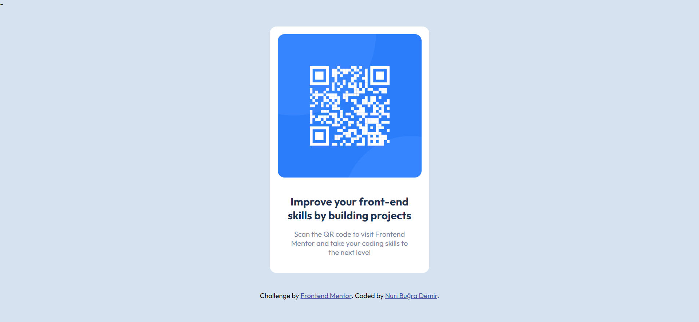

# Frontend Mentor - QR code component solution

This is a solution to the [QR code component challenge on Frontend Mentor](https://www.frontendmentor.io/challenges/qr-code-component-iux_sIO_H). Frontend Mentor challenges help you improve your coding skills by building realistic projects. 

## Overview

### Screenshot

### Links

- Solution URL: [Click to reach solution](https://www.frontendmentor.io/solutions/qr-code-component-ph83lNYU7U)
- Live Site URL: [Click to reach live site](https://elegant-cascaron-997a64.netlify.app/)

## Author

- Frontend Mentor - [@nuribugra](https://www.frontendmentor.io/profile/nuribugra)
- Twitter - [@nuribugrademir](https://www.twitter.com/nuribugrademir)
